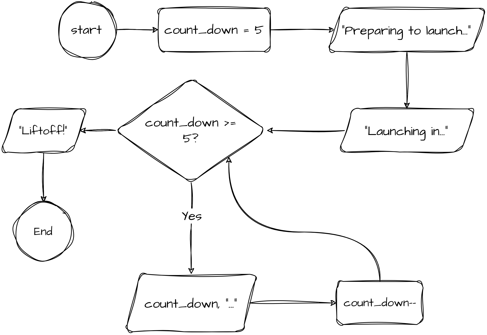

# Debugging Warm-Up 04

The program is a count down to a launch, counting from 5 to 1, then printing launch!

## Flow Chart



## Pseudocode

```
FUNCTION main()
    DECLARE count_down : INTEGER

    count_down <-- 5

    OUTPUT "Preparing to launch..."
    OUTPUT "Launching in..."

    WHILE count_down >= 0
        OUTPUT count_down, "..."
        count_down -= 1
    ENDWHILE

    OUTPUT "Liftoff!"
ENDFUNCTION
```
